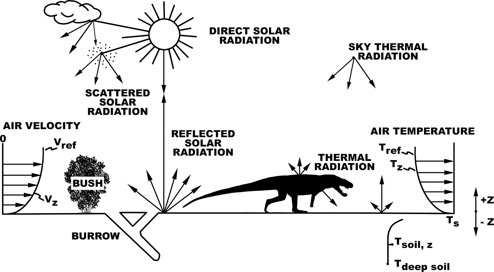

In 2012 I joined Warren Porter, David Lovelace, and Paul Mathewson to apply Niche Mapper, a mechanistic model of the heat and water exchange between an animal and its environment, to extinct vertebrates.

Niche Mapper pairs a microclimate model, which rebuilds the hour-by-hour temperatures, wind, humidity, and radiation an animal would experience, with an animal model built from body size and shape, posture, insulation, and metabolism. Rather than asking whether a dinosaur was "warm-blooded," it lets us ask which combinations of metabolic rate, insulation, and body size could survive in a given environment, and where.

Our first test case, *Modeling Dragons* (Lovelace et al. 2020), examined Late Triassic dinosaurs from the Chinle Formation. It found support for elevated, ratite-like metabolic rates, and suggested that large prosauropods would have been heat-stressed in open, hot environments. Follow-up work extended the approach to predict the biogeographic distribution of Late Triassic terrestrial amniotes (Hartman et al. 2022), and my dissertation applied it to macroevolution, thermal ecology, and extinction in Mesozoic tetrapods.
